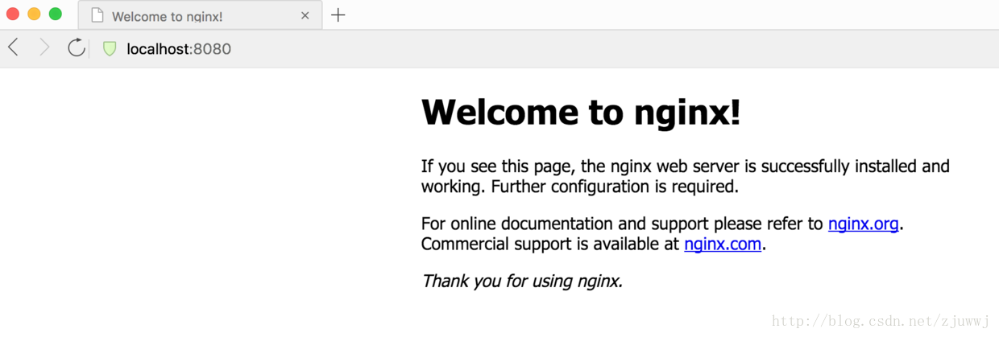

# Drupal+Nginx+Mysql 介绍以及环境搭建  

## 一、简介

本篇文章主要介绍了Nginx+PHP+MySql的一些概念以及基于这三个模块进行环境搭建时的过程和遇到的一些难点，Drupal的概念介绍和安装过程中遇到的困难等。另：我也是新手，有什么配置不对的地方，还希望大家多多指正。

## 二、环境搭建
### 1.Nginx
#### （1）介绍

Nginx (“engine x”) 是一个高性能的HTTP和反向代理服务器，也是一个IMAP/POP3/SMTP服务器。Nginx是由Igor Sysoev为俄罗斯访问量第二的Rambler.ru站点开发的，第一个公开版本0.1.0发布于2004年10月4日。其将源代码以类BSD许可证的形式发布，因它的稳定性、丰富的功能集、示例配置文件和低系统资源的消耗而闻名。2011年6月1日，nginx 1.0.4发布。

Nginx是一款轻量级的Web 服务器/反向代理服务器及电子邮件（IMAP/POP3）代理服务器，并在一个BSD-like 协议下发行。由俄罗斯的程序设计师Igor Sysoev所开发，供俄国大型的入口网站及搜索引擎Rambler（俄文：Рамблер）使用。其特点是占有内存少，并发能力强，事实上nginx的并发能力确实在同类型的网页服务器中表现较好，中国大陆使用nginx网站用户有：百度、京东、新浪、网易、腾讯、淘宝等。

#### （2）安装

- 安装：sudo brew install nginx
- 查看版本：nginx -v
- 启动Nginx：sudo nginx
- 关闭Nginx：sudo nginx -s stop
- 重新加载：sudo nginx -s reload
- 查看Nginx是否启动成功：在浏览器中访问 http://localhost:8080，如果出现如下界面，则说明启动成功



注：端口号是在配置文件 nginx.conf 里面配置的，默认端口是 8080 ，配置文件的位置 /usr/local/etc/nginx

启动服务器：

- 启动nginx服务，sudo nginx；
- 启动php服务，sudo php-fpm；
- 在浏览器地址栏中输入localhost:8080，如果配置正确地话，应该能看到PHP相关信息的页面。

#### (3) 配置（目的：使Nginx能运行.php文件）
1.安装好nginx后运行：
```bash
cd /usr/local/etc/nginx/ 
mkdir conf.d
vim nginx.conf
vim ./conf.d/default.conf
```
2.nginx.conf文件的内容改为：
```bash
worker_processes 1;
 
error_log /usr/local/var/log/nginx/error.log warn;
 
pid /usr/local/var/run/nginx.pid;
 
events {
        worker_connections 256;
}
 
http {
include mime.types;
default_type application/octet-stream;
 
log_format main 
'$remote_addr - $remote_user [$time_local] "$request" '
'$status $body_bytes_sent "$http_referer" '
'"$http_user_agent""$http_x_forwarded_for"';
 
access_log /usr/local/var/log/nginx/access.log main;
port_in_redirect off;
sendfile on; 
keepalive_timeout 65;
 
include /usr/local/etc/nginx/conf.d/*.conf;
}
```
3.default.conf的内容改为：
```bash
server {
listen 8080;
server_name localhost;
 
root /Users/user_name/nginx_sites/; # 该项要修改为你准备存放相关网页的路径（.php文件上一级文件夹的路径）
 
location / {
index index.php;
autoindex on;
}
 
#proxy the php scripts to php-fpm
location ~ \.php$ {
include /usr/local/etc/nginx/fastcgi.conf;
fastcgi_intercept_errors on;
fastcgi_pass 127.0.0.1:9000;
}

}
```

### 2.PHP
#### （1）介绍
PHP 作为一种强大的语言，无论是以模块还是 CGI 的方式安装，它的解释器都可以在服务器上访问文件、运行命令以及创建网络连接等。这些功能也许会给服务器添加很多不安全因素，但是只要正确地安装和配置 PHP，以及编写安全的代码，那么 PHP 相对于 Perl 和 C 来说，是能创建出更安全的 CGI 程序的。而且，也可以在可用性和安全性之间找到一个很好的平衡点。

PHP 可能会被用在很多不同的方面，因此，PHP 内置的选项以方便用户对其进行配置。虽然众多的选项可以使 PHP 完成很多工作，但是对这些选项的设定以及对服务器的配置很可能会产生安全问题。

PHP 的选项与其语法一样，具有很高的灵活性。使用 PHP，可以在只有 shell 用户权限的环境下创建完善的服务器端程序，或者在被严格限制环境下使用它来完成服务器端包含（Server-Side Includes）而无需承但太大的风险。如何建立这样一种环境，其安全性如何，很大程度上取决于 PHP 的开发者。

#### （2）安装
Mac OSX 系统自带了PHP、php-fpm，省去了安装php-fpm的麻烦。 这里需要简单地修改下php-fpm的配置，否则运行php-fpm会报错。

#### （3）配置
首先运行：
```bash
sudo cp /private/etc/php-fpm.conf.default /private/etc/php-fpm.conf
vim /private/etc/php-fpm.conf
```
修改php-fpm.conf文件中的error_log项，默认该项被注释掉，这里需要去注释并且修改为error_log = /usr/local/var/log/php-fpm.log。如果不修改该值，运行php-fpm的时候会提示log文件输出路径不存在的错误。

接着运行：
```bash
sudo cp /private/etc/php-fpm.d/www.conf.default /private/etc/php-fpm.d/www.conf
```
### 3.MySql

#### （1）介绍
Mysql是最流行的关系型数据库管理系统，在WEB应用方面MySQL是最好的RDBMS(Relational Database Management System：关系数据库管理系统)应用软件之一。

#### （2）安装
运行 $ brew install mysql 安装 mysql，之后可能需要重启一下终端，然后成功的话输入 $ mysql 再按 Tab 会提示一些和 mysql 相关的命令出来，如果有的话就 OK 了。

#### （3）配置
启动服务器：
```bash
$ mysql.server start
Starting MySQL
.. SUCCESS!$ mysq
```
关闭服务器：
```bash
$ mysql.server stop
Shutting down MySQL
.. SUCCESS!
```
设置mysql的root账户密码并登录：
```bash
$ mysqladmin -u root password
New password:
Confirm new password:
$ mysql -u root -p
Enter password:
```
之后可以做一些简单操作，例如创建数据库什么的。为了方便操作和查看，这里推荐一个数据库可视化软件： Sequel Pro，mac下是免费的而且功能强大。

## 三、Drupal 介绍
Drupal是开发网站最流行的平台之一。随着越来越多的组织希望为其利益相关者构建引人入胜的数字体验，Drupal内容管理系统提供了一个移动优先平台，该平台具有对集成，更好的性能和可扩展性的本地支持。新版本为其模块开发和主题创建技术带来了重大变化，提高了性能并改善了开发体验。

## 四、Drupal 安装

### 1.从drupal8官网下载drupal.tar.gz文件并且解压，修改/usr/local/etc/nginx/conf.d路径下default.conf文件中root后面对应的目录改成这个解压后的文件地址。

### 2.修改default.conf文件中的内容：
#### （1）注释下面代码：
```bash
# location / {
# index index.php;
# autoindex on;
# }
```
#### （2）并且在原有代码后追加：
```bash
location = /favicon.ico { 
        log_not_found off; 
        access_log off; 
    }
 
    location = /robots.txt { 
        allow all; 
        log_not_found off; 
        access_log off; 
    }
 
    # Very rarely should these ever be accessed outside of your lan 
    location ~* \.(txt|log)$ { 
        allow 192.168.0.0/16; 
        deny all; 
    }
 
    location ~ \..*/.*\.php$ { 
        return 403; 
    }
 
    location ~ ^/sites/.*/private/ { 
        return 403; 
    }
 
    # Block access to scripts in site files directory 
    location ~ ^/sites/[^/]+/files/.*\.php$ { 
        deny all; 
    }
 
    # Allow "Well-Known URIs" as per RFC 5785 
    location ~* ^/.well-known/ { 
        allow all; 
    }
 
    # Block access to "hidden" files and directories whose names begin with a 
    # period. This includes directories used by version control systems such 
    # as Subversion or Git to store control files. 
    location ~ (^|/)\. { 
        return 403; 
    }
 
    location / { 
        # try_files $uri @rewrite; # For Drupal <= 6 
        try_files $uri /index.php?$query_string; # For Drupal >= 7 
    }
 
    location @rewrite { 
        rewrite ^/(.*)$ /index.php?q=$1; 
    }
 
    # Don't allow direct access to PHP files in the vendor directory. 
    location ~ /vendor/.*\.php$ { 
        deny all; 
        return 404; 
    }
 
    # In Drupal 8, we must also match new paths where the '.php' appears in 
    # the middle, such as update.php/selection. The rule we use is strict, 
    # and only allows this pattern with the update.php front controller. 
    # This allows legacy path aliases in the form of 
    # blog/index.php/legacy-path to continue to route to Drupal nodes. If 
    # you do not have any paths like that, then you might prefer to use a 
    # laxer rule, such as: 
    #   location ~ \.php(/|$) { 
    # The laxer rule will continue to work if Drupal uses this new URL 
    # pattern with front controllers other than update.php in a future 
    # release. 
    location ~ '\.php$|^/update.php' { 
        fastcgi_split_path_info ^(.+?\.php)(|/.*)$; 
        # Security note: If you're running a version of PHP older than the 
        # latest 5.3, you should have "cgi.fix_pathinfo = 0;" in php.ini. 
        # See http://serverfault.com/q/627903/94922 for details. 
        include fastcgi_params; 
        # Block httpoxy attacks. See https://httpoxy.org/. 
        fastcgi_param HTTP_PROXY ""; 
        fastcgi_param SCRIPT_FILENAME $document_root$fastcgi_script_name; 
        fastcgi_param PATH_INFO $fastcgi_path_info; 
        fastcgi_param QUERY_STRING $query_string; 
        fastcgi_intercept_errors on; 
        # PHP 5 socket location. 
        #fastcgi_pass unix:/var/run/php5-fpm.sock; 
        # PHP 7 socket location. 
        fastcgi_pass unix:/var/run/php/php7.0-fpm.sock; 
    }
 
    # Fighting with Styles? This little gem is amazing. 
    # location ~ ^/sites/.*/files/imagecache/ { # For Drupal <= 6 
    location ~ ^/sites/.*/files/styles/ { # For Drupal >= 7 
        try_files $uri @rewrite; 
    }
 
    # Handle private files through Drupal. Private file's path can come 
    # with a language prefix. 
    location ~ ^(/[a-z\-]+)?/system/files/ { # For Drupal >= 7 
        try_files $uri /index.php?$query_string; 
    }
 
    location ~* \.(js|css|png|jpg|jpeg|gif|ico|svg)$ { 
        try_files $uri @rewrite; 
        expires max; 
        log_not_found off; 
    } 
}
```
#### （3）进入drupal8父目录 运行sudo chmod -R 777 drupal（文件夹名称） 修改文件夹权限
#### （4）运行sudo nginx -s reload和sudo php-fpm重新启动服务，在http://localhost:8080按步骤进行安装
#### （5） 在安装页面进行到第四步设置数据库之前，先下载mysql数据库可视化软件sequel pro ，首先修改mysql密码策略，然后root身份登录，创建新数据库，为新数据库添加新的用户和密码并设置权限。最后ifconfig查询本机ip，把drupal安装页下面高级选项中的localhost替换为本机ip就可以进入到下一步了。

## 五、Drush 介绍 & 安装
### 1.介绍：Drush是Drupal的命令行shell和脚本界面。借助Drush，您可以使用单行命令轻松配置您的Drupal站点。通常情况下，人们希望有可视化界面来配置和管理网站，因为它看起来更安全，更花哨，但是经过人们这些年对于Drupal的开发经验，人们注意到自从直接进入脚本世界而不是可视化界面世界以来。人们对于Drupal提供的管理越来越不热情，越来越多的人将代码放在文件（自定义模块/主题）中。人们的编码方式完全改变了，我猜这就是它的原因。
### 2.安装drush
- 首先官网下载最新安装包
- 运行$ sudo mv drush /usr/local/lib/
- 运行$ sudo chmod u+x /usr/local/lib/drush/drush 使得文件可执行
- 建立连接 $ sudo ln -s /usr/local/lib/drush/drush /usr/bin/drush
- 进入安装drupal的文件夹运行drush list查看可运行的命令
## 六、总结
通过上面一系列步骤应该可以搭建好基于Nginx+PHP+Mysql的Drupal8开发环境，下面就尽快投入到Drupal8的开发当中吧！